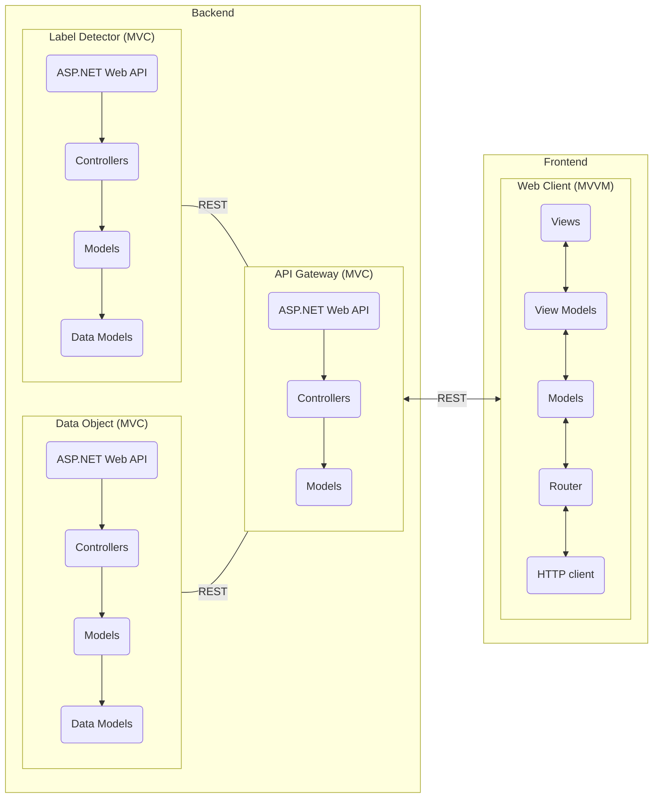

# RIA2
The project repository for the RIA2 module.

## Description
This project is part of the RIA2 module. The main objective of this module is to develop a rich internet application that will use the [BI](https://github.com/VivienCPNV/BI) module project as the backend for this project.

This is the architecture designed for the project.


## Getting Started
Before you start using this project, there are a few things you need to make sure of.

### Prerequisites
List all dependencies and their version needed by the project as :

* IDE: Visual Studio Code, Notepad++, Vim, any text editor
* Package manager: npm
* OS: Windows (tested), Linux (untested), macOS (untested)
* Runtime: node.js (v20)

### Configuration
For this project to work, you need to set a few environment variables you need to set first (this is only if you plan to copy paste the commands, if you know your way around docker ignore these).

| KEY | Value | Description |
|-----|-------|-------------|
| VISION_ENDPOINT | https://username.cognitiveservices.azure.com/ | The api endpoint to use for label detection |
| VISION_KEY | 32 characters long api key | The api key to use for label detection |
| AZURE_DATA_STORAGE_CONNECTION_STRING | Connection URI | The connection URI that contains all the required information to access the data container |
| BUCKET_URI | Uri | A uri to the bucket |


## Deployment
For you to deploy this project, you either need to pull the prebuilt docker images available in the repo or you can clone the repo to build it yourself.

### Pull docker images
You can pull the different images with the following commands:

Frontend:
```shell
$ docker pull ghcr.io/cpnv-es-ria2/frontend:main
```
Backend:
```shell
$ docker pull ghcr.io/cpnv-es-ria2/backend:main
```

### Build the docker images
If you want to build the images yourself, firstly you need to clone the repository locally with the following command:
```shell
$ git clone git@github.com:CPNV-ES-RIA2/VIVIEN.git
```

Build frontend:
```shell
$ cd frontend
$ docker build -t cpnv-es-ria2/frontend .
```
Build backend
```shell
$ cd backend
$ docker build -f ".\gateway\Dockerfile" --force-rm -t cpnv-es-ria2/gateway  --build-arg "BUILD_CONFIGURATION=Release" ".\path\to\backend\dir"
```

### Start the container
Now that you either pulled the images or built them, you can start the containers, to do this run the following commands.
Run frontend:
```shell
$ docker run --name frontend -p 80:80 cpnv-es-ria2/frontend
```

Run backend:
```shell
$ docker run --name gateway -e VISION_ENDPOINT=<VISION_ENDPOINT> -e VISION_KEY=<VISION_KEY> -e AZURE_DATA_STORAGE_CONNECTION_STRING=<AZURE_DATA_STORAGE_CONNECTION_STRING> -e BUCKET_URI=<BUCKET_URI> -p 80:80 -p 443:443 cpnv-es-ria2/gateway
```

## Directory structure
```shell
<PROJECT_DIR>
├───.github
│   └───workflows                           // Github workflows
├───backend
│   ├───AzureDataObject                     // Azure DataObjet implementation
│   ├───AzureLabelDetector                  // Azure LabelDetector implementation
│   └───gateway                             // API gateway implementation
│       ├───bin
│       │   └───Debug
│       ├───Controllers
│       └───Properties
└───frontend
    ├───cypress
    │   ├───e2e
    │   ├───fixtures
    │   └───support
    ├───public                              // Public folder mounted to root
    └───src
        ├───assets                          // CSS, SCSS, SVG
        ├───components                      // Vue.JS components
        │   └───__tests__                   // Test files location
        ├───i18n                            // Translation module
        │   └───languages                   // Translation languages
        ├───router                          // App frontend router
        └───views                           // App views
```

## Collaborate

This project is an Open Source project encouraging everyone to be fearless in their contributions. This document lists some ground rules to foster a happy collaborative atmosphere.

- Be polite
- Keep the conversation on topic (no politics)
### For issue reporters
- Check issues before posting (this is to avoid duplicate issues)
- Provide as much detail as possible (OS, environment, steps to replicate, etc.)
- Follow the issue template
### For contributors
- Follow naming conventions outlined in our [wiki](https://github.com/CPNV-ES-RIA2/VIVIEN/wiki)
- Follow commit conventions outlined in our [wiki](https://github.com/CPNV-ES-RIA2/VIVIEN/wiki)
- Follow the pull request template
### For collaborators
- Follow naming conventions outlined in our [wiki](https://github.com/CPNV-ES-RIA2/VIVIEN/wiki)
- Follow commit conventions outlined in our [wiki](https://github.com/CPNV-ES-RIA2/VIVIEN/wiki)
- Follow the git flow workflow

## License
This code is licensed under the [GNU General Public License v3.0](https://github.com/CPNV-ES-RIA2/VIVIEN/blob/main/LICENSE).

## Contact

To get in contact with the repo maintainer, send an email to Vivien.Piccin@eduvaud.ch or head to [issues](https://github.com/CPNV-ES-RIA2/issues) if you'd like to report something.
