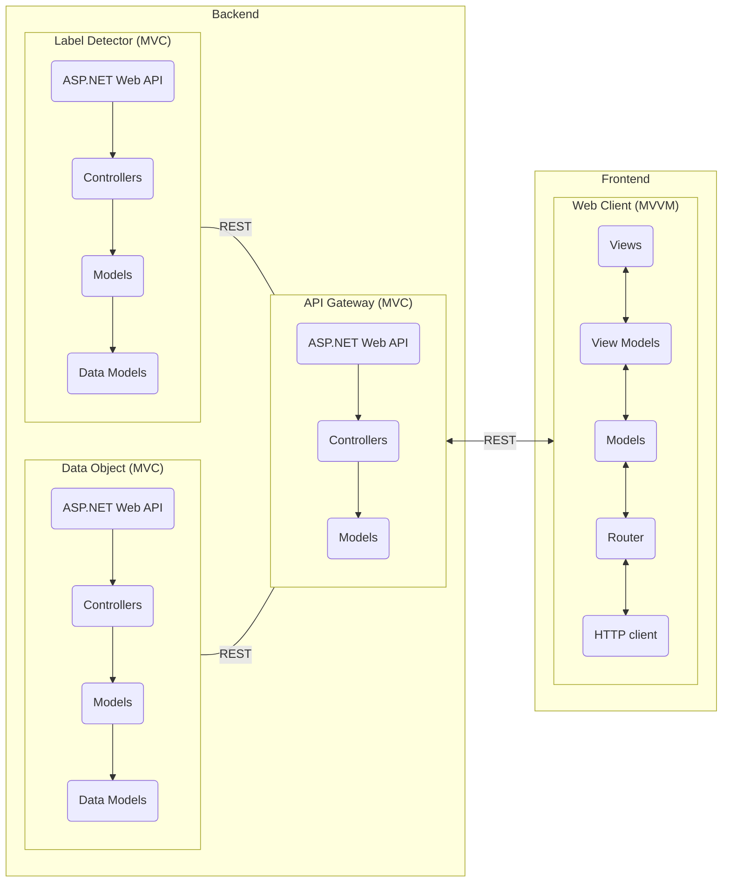

# RIA2
The project repository for the RIA2 module.

## Description
This is the architecture of the project.

## Getting Started
TODO

### Prerequisites
List all dependencies and their version needed by the project as :

* IDE: 
* Package manager: 
* OS: 
* Runtime: 

### Configuration
TODO

## Deployment
TODO

### On integration environment
TODO

## Directory structure
TODO

## Collaborate
TODO

## License
TODO

## Contact

To get in contact with the repo maintainer, send an email to Vivien.Piccin@eduvaud.ch or head to [issues](https://github.com/VivienCPNV/RIA2/issues) if you'd like to report something.
